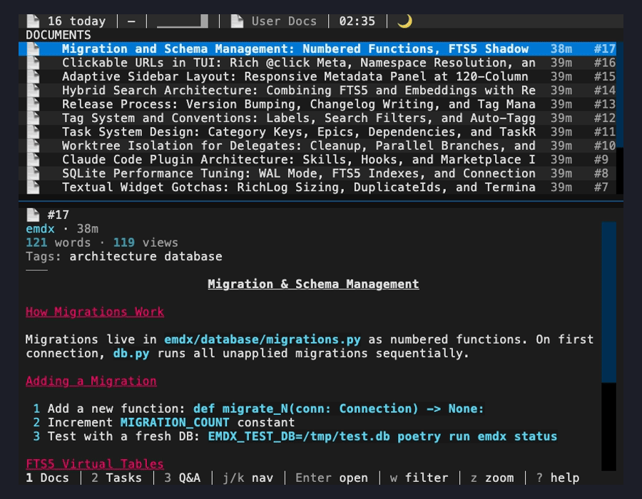

# emdx

[](https://github.com/arockwell/emdx/releases)
[](https://www.python.org/downloads/)
[](https://opensource.org/licenses/MIT)

**Save everything. Search by meaning. Track what's next.**

AI sessions start from zero. emdx doesn't. Save your research, search it by meaning, and track what's left. One CLI, local SQLite, nothing vanishes.



## See it in action

```bash
# Save findings as you go
$ emdx save "Token refresh fails when clock skew > 30s..." --title "Auth Bug Analysis"
✅ Saved as #42: Auth Bug Analysis

# Track what needs doing
$ emdx task add "Fix token refresh bug" --cat FIX
$ emdx task add "Add rate limiting" --cat FEAT

# Search by meaning, not just keywords
$ emdx find "how we handle token expiry" --mode semantic
🔍 Found 4 results

# Ask your KB directly
$ emdx find --ask "What causes the auth failures?"
💡 Based on 3 documents: Token refresh fails when clock skew exceeds 30s...

# Distill everything into a briefing for your team
$ emdx distill "auth" --for coworkers --save
✅ Saved as #46: Distilled: auth
```

## Install

```bash
uv tool install emdx    # or: pip install emdx
emdx --help
```

## Save

Files, notes, piped command output — anything you save becomes searchable. Tag things so you can find them by topic later.

```bash
# Save a file
$ emdx save --file meeting-notes.md
✅ Saved as #12: meeting-notes

# Save a quick note
$ emdx save "the auth bug is in token refresh" --title "Auth Bug"
✅ Saved as #13: Auth Bug

# Pipe in anything
$ docker logs api --since 1h | emdx save --title "API errors"
✅ Saved as #14: API errors

# Tag things so you can slice by topic
$ emdx tag 12 planning active
$ emdx tag 13 bugfix security

# Find by keyword — full-text search across everything
$ emdx find "auth"
🔍 Found 3 results for 'auth'

# Or filter by tags
$ emdx find --tags "security"
```

## Track

Organize work with tasks, epics, and categories.

```bash
# Create tasks as you discover work
$ emdx task add "Fix token refresh bug" --cat FIX
$ emdx task add "Add rate limiting to API" --cat FEAT --epic 42

# See what's ready to work on
$ emdx task ready

# Mark progress
$ emdx task active 15
$ emdx task done 15

# Group work under epics
$ emdx task epic list
```

## AI features

Search by meaning, get AI-powered answers, and explore your knowledge base in new ways:

```bash
# Semantic search — "rate limiting" finds docs about throttling, backoff, quotas
$ emdx find "how we handle rate limiting" --mode semantic

# Ask your KB directly (needs API key)
$ emdx find --ask "What did we decide about the API redesign?"

# Add inline citations to any AI answer
$ emdx find --ask --cite "how does auth work?"

# Build a position paper with arguments for and against
$ emdx find --think "rewrite the API in Rust"

# Devil's advocate — find evidence against a position
$ emdx find --think --challenge "rewrite the API in Rust"

# Socratic debugging — diagnostic questions from your bug history
$ emdx find --debug "TUI freezes on click"

# Serendipity — surface surprising but related documents
$ emdx find --wander "machine learning"

# Build a context package and pipe it to Claude
$ emdx find --context "How does auth work?" | claude

# Distill content for a specific audience
$ emdx distill "deployment" --for coworkers
$ emdx distill "auth" --for docs --save
```

## Standing queries

Set up watches that alert you when new documents match:

```bash
$ emdx find --watch "deployment"
👁️ Standing query #1 saved: deployment

$ emdx find --watch-check
🔔 Query #1 "deployment": 2 new matches since last check

$ emdx find --watch-list
$ emdx find --watch-remove 1
```

## Wiki

Auto-generate a wiki from your knowledge base:

```bash
# Bootstrap: build index, extract entities, discover topics
$ emdx wiki setup

# Generate articles from topic clusters
$ emdx wiki generate -c 3
📝 Generated 47/52 articles ($0.83)

# Search and view wiki articles
$ emdx wiki search "authentication"
$ emdx wiki view 42

# Export as a static MkDocs site
$ emdx wiki export ./wiki-site --build
```

## Version history

Every edit is tracked with SHA-256 content hashes:

```bash
$ emdx history 42
  v1  2026-02-15  +1,204 chars  manual edit
  v2  2026-02-20    +87 chars   auto-update

$ emdx diff 42        # diff against previous version
$ emdx diff 42 1      # diff against version 1
```

## More features

```bash
emdx maintain compact --dry-run                  # Deduplicate similar docs
emdx maintain compact --auto                     # Merge discovered clusters
emdx maintain freshness                          # Score document staleness (0-1)
emdx maintain gaps                               # Detect knowledge gaps and orphans
emdx maintain drift                              # Find abandoned or forgotten work
emdx maintain contradictions                     # Detect conflicting claims across docs
emdx maintain backup                             # Daily backup with logarithmic retention
emdx status                                      # Knowledge base overview and health metrics
emdx db status                                   # Show active database path and reason
emdx gui                                         # Interactive TUI browser
```

## Quick reference

| I want to... | Command |
|--------------|---------|
| Save a file | `emdx save --file doc.md` |
| Save a note | `emdx save "quick note" --title "Title"` |
| Find by keyword | `emdx find "query"` |
| Find by meaning | `emdx find "query" --mode semantic` |
| Find by tag | `emdx find --tags "active"` |
| View a document | `emdx view 42` |
| Tag a document | `emdx tag 42 analysis active` |
| Ask your KB a question | `emdx find --ask "question"` |
| Get cited answers | `emdx find --ask --cite "question"` |
| Build a position paper | `emdx find --think "proposal"` |
| Debug with your KB | `emdx find --debug "bug description"` |
| Discover forgotten docs | `emdx find --wander` |
| Watch for new matches | `emdx find --watch "query"` |
| Pipe context to Claude | `emdx find --context "question" \| claude` |
| Distill for an audience | `emdx distill "topic" --for coworkers` |
| Add a task | `emdx task add "title" --cat FEAT` |
| See ready tasks | `emdx task ready` |
| View document history | `emdx history 42` |
| Diff document versions | `emdx diff 42` |
| Generate a wiki | `emdx wiki setup && emdx wiki generate` |
| Search wiki articles | `emdx wiki search "query"` |
| Check KB health | `emdx maintain freshness && emdx maintain gaps` |
| Detect contradictions | `emdx maintain contradictions` |

## Documentation

- [CLI Reference](docs/cli-api.md) — Complete command documentation
- [AI System](docs/cli-api.md#find) — Semantic search, embeddings, and Q&A
- [Architecture](docs/architecture.md) — System design
- [Development Setup](docs/development-setup.md) — Contributing guide

## License

MIT License — see LICENSE file.
